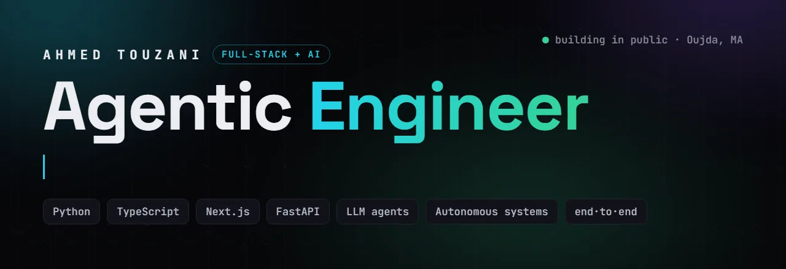
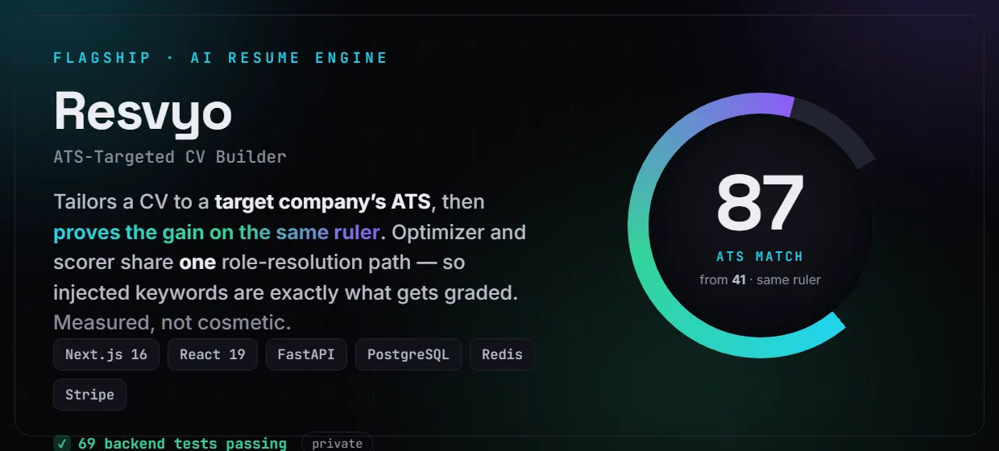
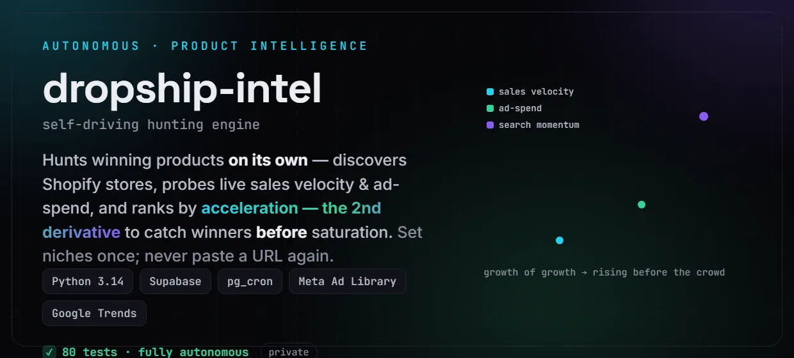
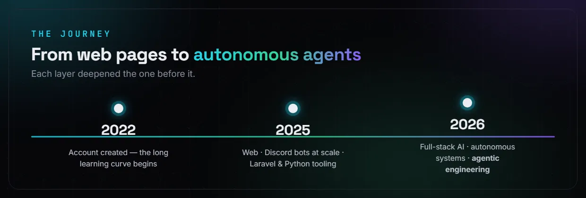
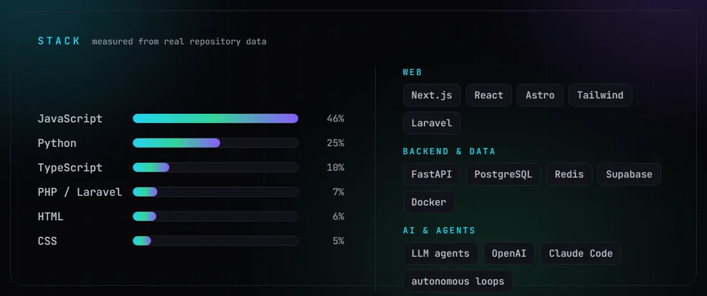
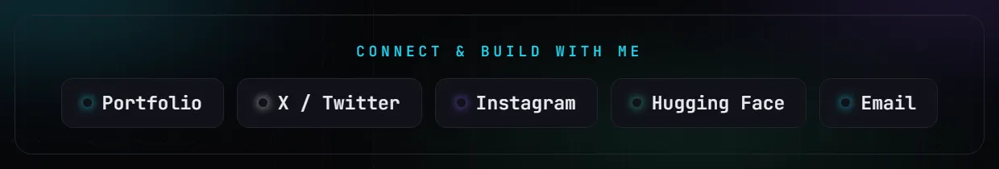

 

**Agentic Engineer** — I design and ship autonomous AI systems end-to-end: agent logic, API, database, payments, deploy.
Not a prompt-writer who can&rsquo;t ship. Not a full-stack dev who doesn&rsquo;t get agents. **Both.**

---

### ⟢ What I build

  

 

Also: <b><a href="https://github.com/ahmedtouzani/portfolio-v2">portfolio-v2</a></b> (Astro + Tailwind, live) &middot; <b>Raymond</b> — Discord automation at scale (752&nbsp;KB JS + PostgreSQL) &middot; <b>Terminal-Tools-Suite</b> (rich Python TUIs)

---

---

---

### ⟢ How I work in the AI era

I treat AI agents as **collaborators, not autocomplete**. I architect the system, write the contracts and tests, then drive agents to implement, refactor, and verify *against* them — staying in the loop on **judgement**, not keystrokes.

This profile is the proof: the hero, the panels, the avatar, the whole brand system were **art-directed end-to-end with an AI agent**, inside a custom design system — **visual _and_ logical**, on purpose. That&rsquo;s the skill — not the prompt.

---

[**Portfolio**](https://ahmedtouzani.github.io/portfolio-v2/) &nbsp;·&nbsp; [**X / Twitter**](https://x.com/mrah48) &nbsp;·&nbsp; [**Instagram**](https://instagram.com/ah_4__8) &nbsp;·&nbsp; [**Hugging Face**](https://huggingface.co/ahmedtouzani39) &nbsp;·&nbsp; [**Email**](mailto:touzaniahmed39@gmail.com)

 

<i>Agentic Engineer · I build AI agents that decide &amp; act · Oujda, Morocco</i>

