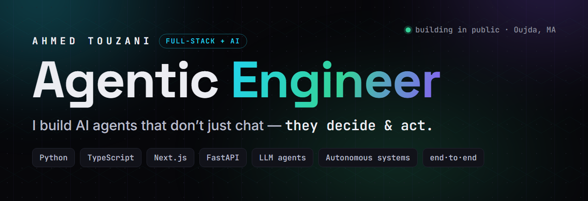
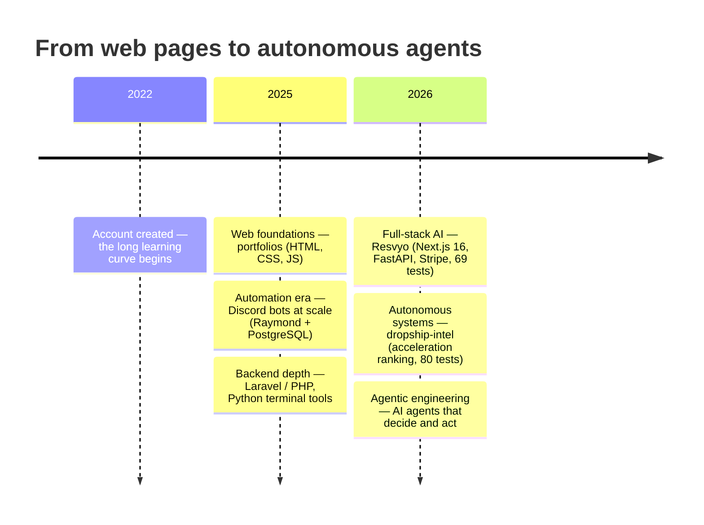

  

---

## ⟢ Who I am

I'm **Ahmed Touzani** — an **Agentic Engineer** from Oujda, Morocco.

I design and ship **autonomous AI systems end-to-end**: the agent logic, the API, the database, the payments, and the deploy. Most builders fall into one of two camps — *prompt-writers who can't ship to production*, or *full-stack devs who don't really get agents.* **I do both.** That's the moat: I take an AI system from idea to deployed product, solo.

> I don't build chatbots. I build agents that **decide** and **act**.

---

## ⟢ What I build

<table>
<tr>
<td width="50%" valign="top">

### 🧠 Resvyo — ATS-Targeted CV Builder
*AI resume engine · `private`*

An AI engine that tailors a CV to a **target company's ATS**, then **_proves_ the gain on the same ruler**. The optimizer and scorer share **one** role-resolution path — so the keywords it injects are *exactly* what the scorer rewards. Measured improvement, not guesswork — enforced in an **ADR**, not in marketing copy.

`Next.js 16` `React 19` `TypeScript` `FastAPI` `PostgreSQL` `Redis` `Stripe` `Docker`

**✓ 69 backend tests passing**

</td>
<td width="50%" valign="top">

### 🛰️ dropship-intel — Autonomous Hunting Engine
*Private intelligence platform · `private`*

A platform that hunts winning products **on its own** — discovers Shopify stores, probes **live sales velocity**, tracks **ad-spend trajectory**, and ranks by **_acceleration_** (the second derivative) to catch winners *before* they saturate. You set the niches **once**; you never paste a store URL again.

`Python 3.14` `Next.js` `Supabase + pg_cron` `Meta Ad Library` `Google Trends`

**✓ 80 tests · fully autonomous**

</td>
</tr>
</table>

Also: <b><a href="https://github.com/ahmedtouzani/portfolio-v2">portfolio-v2</a></b> (Astro + Tailwind, live) · <b>Raymond</b> — a Discord automation bot at scale (752 KB JS + PostgreSQL) · <b>Terminal-Tools-Suite</b> (rich Python TUIs) · <b>weather-dashboard</b>.

---

## ⟢ The journey

Web → automation → tooling → full-stack AI → **autonomous agents.** Each layer deepened the one before it.

---

## ⟢ Stack

**Languages**

**Web & Frameworks**

**Backend & Data**

**AI & Agents**

---

## ⟢ How I work in the AI era

I treat AI agents as **collaborators, not autocomplete**. I architect the system, write the contracts and tests, and drive agents to implement, refactor, and verify *against* them — staying in the loop on **judgement**, not keystrokes.

This profile is itself an example: the hero banner, the avatar, and the whole brand system were **art-directed end-to-end with an AI agent**, inside a custom design system — **visual _and_ logical**, on purpose. That's the skill — not the prompt.

---

## ⟢ Connect

 

<i>Agentic Engineer · I build AI agents that decide & act · Oujda, Morocco</i>

